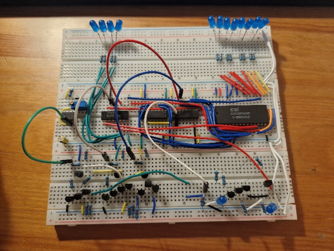
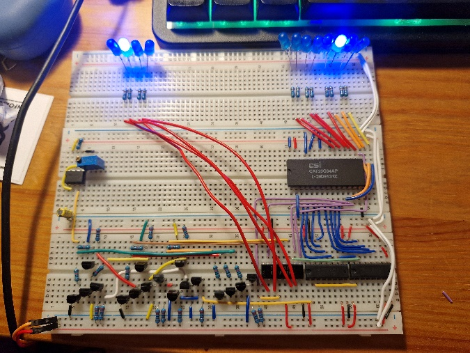
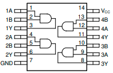
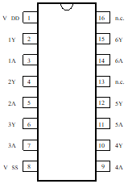
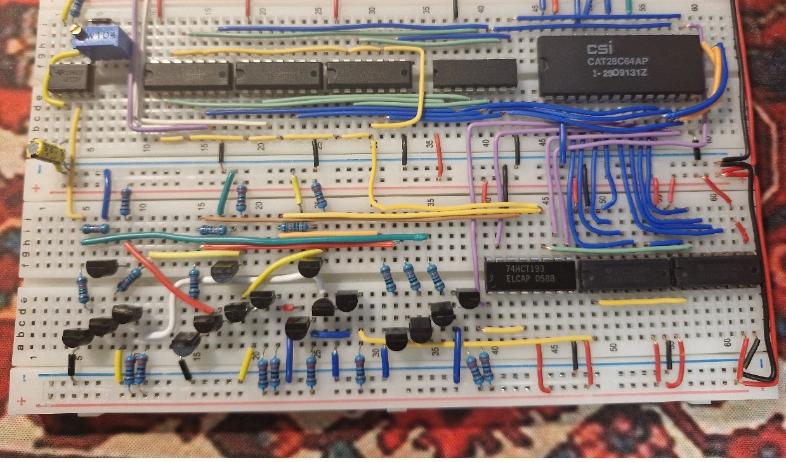
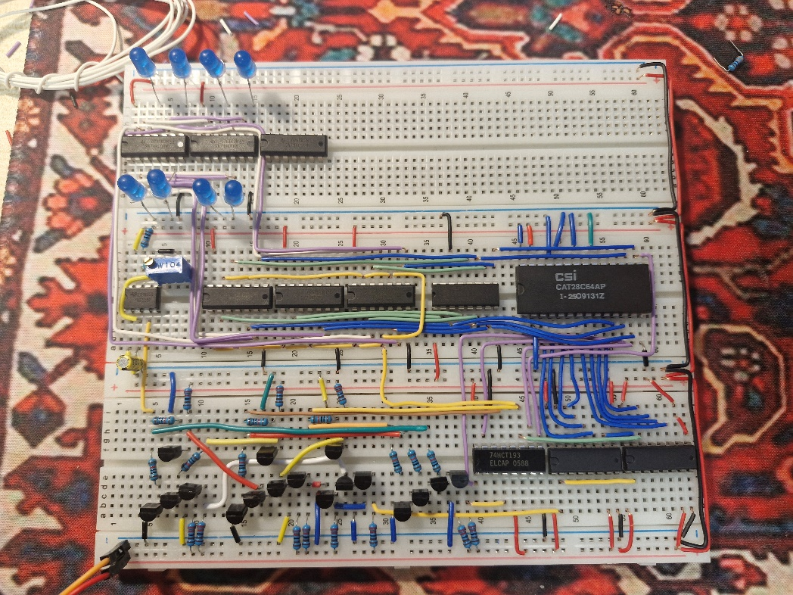
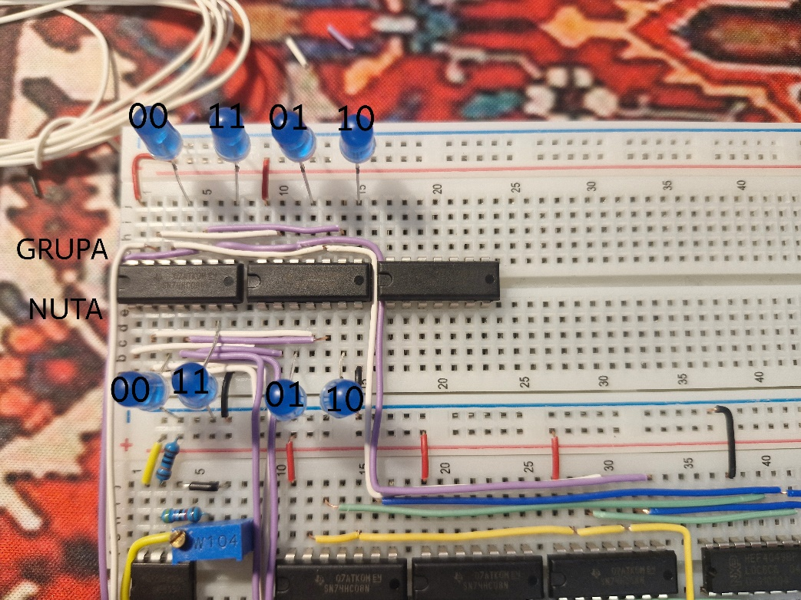
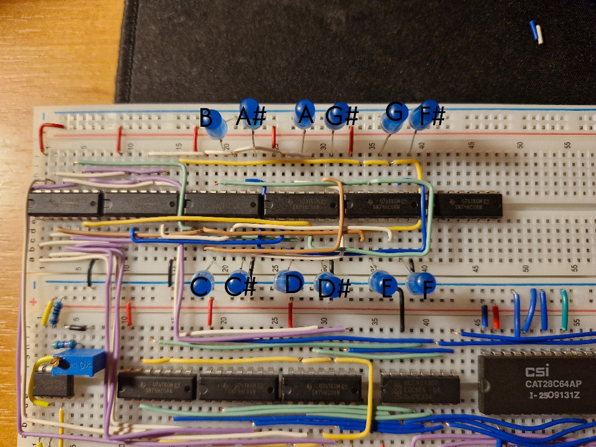

# Week 4. (24-31.03.2026)

I could only start work towards the end of the week due to being overwhelmed with various matters... Despite this, in the meantime I had time to calmly think about the project. I managed to notice two problems:

- At this point, the signal from EEPROM comes out regardless of whether it's a note or its duration (in other words, only notes can go to the decoder, not their duration)

- The circuit takes up a lot of space on the boards, and soon it will run out completely

First, I'll deal with the second problem, because the current circuit can be better planned on the boards and at the same time gain some valuable space:

  

    
    
<strong>Before</strong>

  

  

    
    
<strong>After</strong>

  

Only the clock and EEPROM remained in place, the controller was significantly downsized, and I moved the address and time counters to the lower board. This way the connections counter - EEPROM will be much simpler to implement. And speaking of connections - I was running out of jumpers from the set I bought at the beginning. I was reluctant to spend another 15zł, because one - the price, and two - the wires were too thick and hard, so it was often difficult to insert them into the board. So I went to the hardware store where I found a 8-wire cable (intended for doorbell use) by the meter. Each wire is a single strand so I wouldn't have to deal with tinning the ends, plus they have a slightly smaller diameter, when bent the wire stays in its position and at the same time is not as hard as standard jumpers. The best thing is the price - 2.50zł per meter! Without hesitation I bought two meters, which will be enough for now and I can always buy more. After all, two meters of such wire is 8*2=16 meters of jumpers in various colors. When connecting the counters to the EEPROM, the comfort of working with these wires was indescribable - I can bend them and route the paths as I like, and on top of that they're thin enough that I can put two wires in one hole, which significantly facilitates modeling some of the connections.

Alright, enough talk about wires - after rearranging the circuit I managed to save about half a board, so I smoothly move to the second (actually first) problem. At this point, if I connected EEPROM directly to the decoder, it would decode not only notes (at odd addresses), but also their durations (at even addresses). Of course that's not intended, note duration only matters to the down counter! So I want only and exclusively the note signal to go to the decoder, that is, when the least significant bit of the address counter has the value 1. So it's enough to "AND" the LSB signal with each of the five EEPROM output lines, but also with each of the negated five EEPROM output lines (because I also use NOT gates in the decoder). So I need 5 NOT gates and 10 AND gates

  
  

I have HEF4049BP circuits (6 NOT gates) and SN74HC08 (4 two-input AND gates), so I take one HEF... and three SN... and install them exactly in the space I saved earlier on the board. I connect the EEPROM signal to the NOT gates, and then connect both the negated signal and the direct one from the memory to the AND gates along with the signal from LSB.

  

After testing (by connecting LEDs to the outputs of the gates) the circuit works as it should - the signal passes only when a note comes out of the memory. Now I'll work on building the final decoder for notes, or rather decoders for group and note in group (to remind you, bits N4 N3 symbolize the group, and N2 N1 - the note in the given group). For this I need 8 AND gates (4 for each "decoder"), that's two SN74HC08 circuits. I simply "AND" the bits with each other (within N4 N3 and then N2 N1) and this way I get 8 outputs - 4 groups of 4 notes:

  

  

This way, the notes are in the bottom row and the groups are in the top row.

Now I need to connect the notes with the groups in such a way that their combinations create actual sequences of notes (it also comes down to connecting each with each). In one octave there are 12 notes, so I need 12 AND gates, that's 3 circuits:

  

Done, let me check if I made a mistake somewhere with the connections. Best to just upload a sequence to EEPROM that goes through the entire octave in order (00000, 00001, 00010, etc.)

After uploading and running the circuit, the LEDs flicker a bit, sometimes they light up, sometimes they don't - I must have made a mistake somewhere.

After the nth attempt to fix it, manually resetting the circuit by disconnecting and reconnecting the power was mildly annoying to say the least. Also, sometimes after a quick reset the counters remembered their value, which was initially puzzling (I didn't think it could happen that way), and then just infuriating. Since the problem lies in the counters, something has to be done about them. As it happens, both counters have a reset pin (good news), but one counter has this pin active-low and the other - active-high (bad news). So to reset all the counters, I have to provide a value of 1 on one and a value of 0 on the other at the same time. At first I had a puzzle how to do this with a button. After all, if the button is not pressed, it's not treated as logical 0, but as an undefined state! (I would connect the button to VCC, and an undefined state because the pin has no connection to ground, just hanging there!). However, I remembered that I have loads of NOT gates on hand - I just need to supply voltage through a button to the active-high counter, and to the other - the negated value (the NOT circuit has separate power, and as a result at value 0 it provides to ground). So I did that, and circuit debugging became much easier. Additionally, such a circuit will come in handy even in the final product for resetting the song.

After a few fixes the circuit works as it should - the LEDs turn on one by one representing sounds starting from C, ending at B - great!

This week has been enough, finally I have the beginning of a decoder that correctly displays notes! The project is slowly coming to an end - now I just need to finish the decoder and assemble the second part of the circuit - the sound generator.

Next class is in 2 weeks due to Easter break, I think I'll be able to finish the project by then. I'm only worried about the number of prototype boards I currently have, it might be tight on space but there's a chance I'll fit.

## TODO (Week 4)

- Completion of the note decoder (more precisely octave decoder)
- Implementation of the sound generator