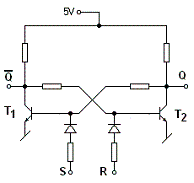
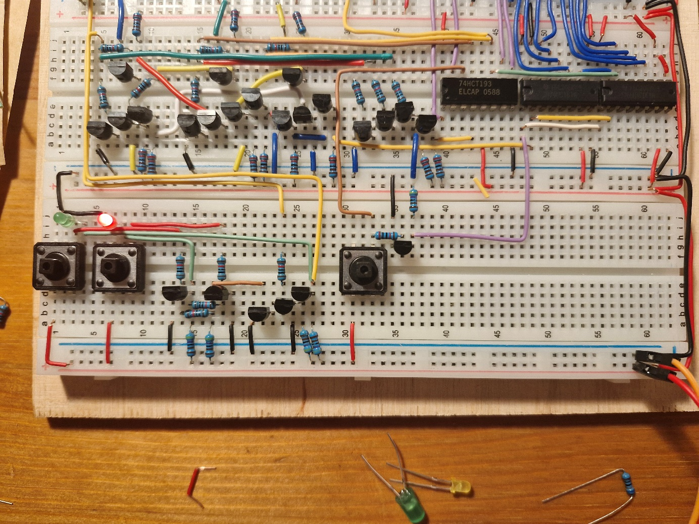
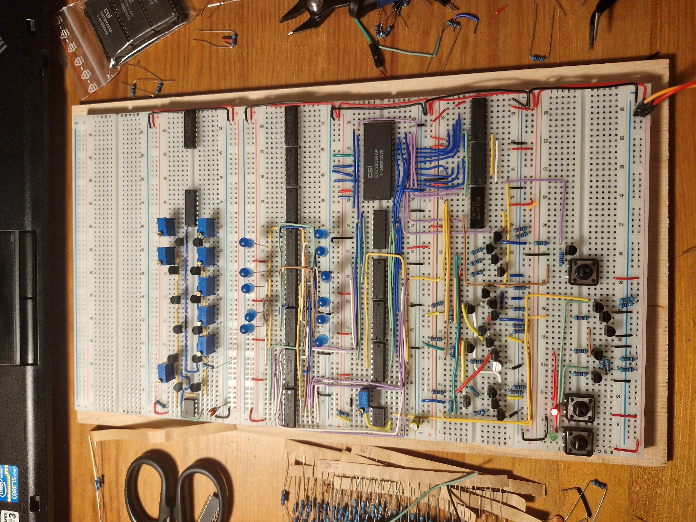
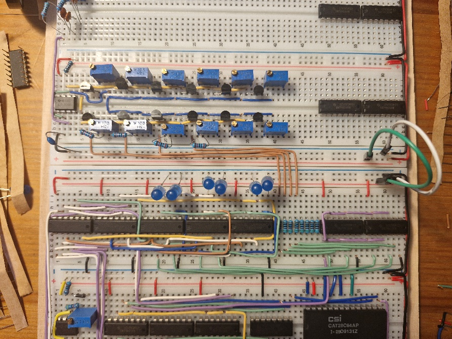
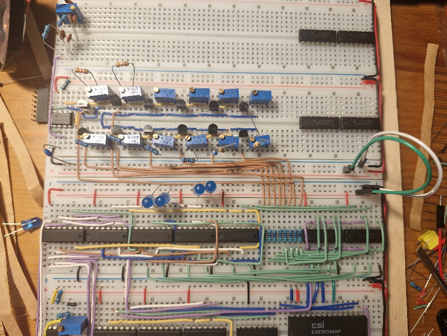
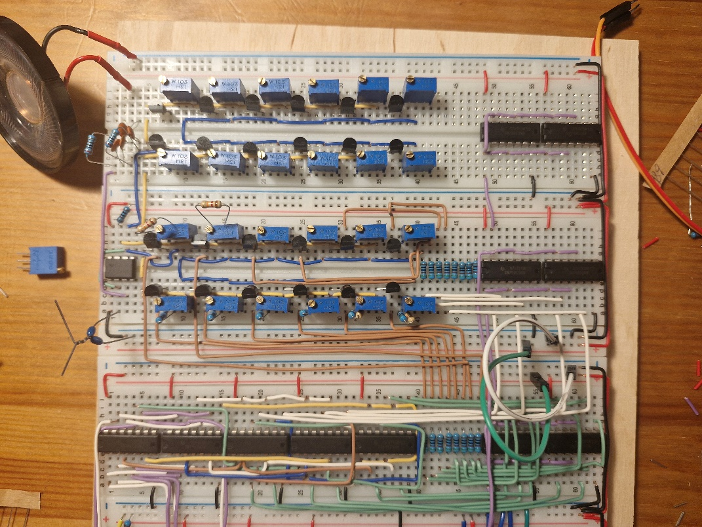
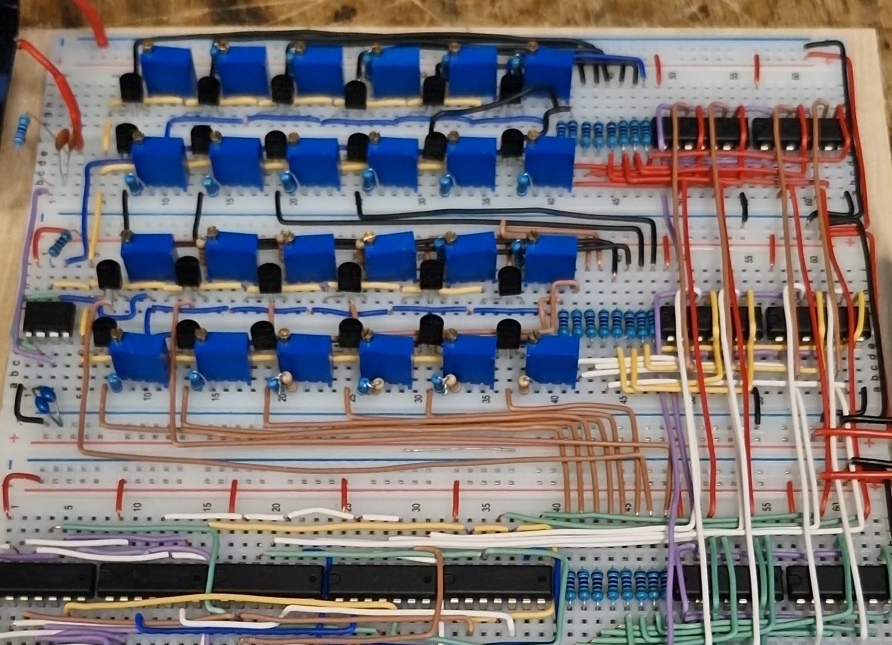
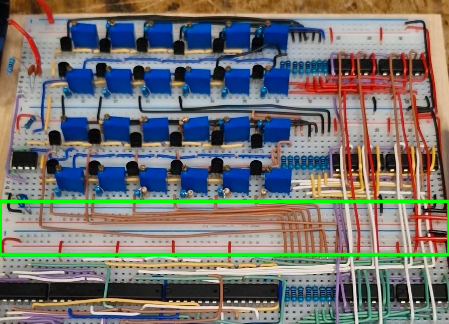

# Weeks 5 and 6. (31.03 - 14.04.2026)

As I mentioned, class was supposed to be in two weeks due to Easter break, and with Easter break comes a return home. I took the circuit with me to tinker with it in free moments during the holidays, but in summary, I almost couldn't get anything done. 

I forgot to bring the rest of my resistors from Krakow (I only had standard values like 1k, 10k, 100k on hand, plus in small quantities). Without them, making the decoder and the sound generator itself was impossible! Additionally, my dark thoughts came true and I started running out of prototype boards. I didn't even have a way to buy components, because there are no electronics stores in my area, and even if there were, they would probably be closed due to holidays. The same applies to online orders - the package would have arrived on Tuesday, April 7, when I would already be in Krakow - where I can buy these things in person. Sadly, I had to wait for my return. Pity, because I probably won't make it to the next class, unless by some miracle I manage to do two weeks of work in one…

On the positive side, I had a lot of time to think about how to arrange the rest of the components so the circuit wouldn't be too big. I had a few ideas, which I even partially managed to implement at home (partial assembly of the note generator without testing), so things aren't so bad.

When I got back to Krakow, I went to the electronics store for prototype boards and transistors for the sound generator.

By the way, I was thinking about what my circuit should ultimately look like. I think I can fit it in 6 prototype boards, and moving this circuit around is mildly inconvenient - the boards only stick together on three latches. Additionally, when lifted they bend, risking the wires falling out. So somehow I need to stiffen these boards, and the most sensible solution seems to be gluing them to a piece of wood. Of course this means I won't be able to unglue these boards later, but probably shouldn't be necessary - as I mentioned, I assume I'll fit on six boards and nothing will need to be added. So I measured the dimensions my circuit would have and went to the hardware store to buy this plywood. I even managed to cut it on site, and the whole thing cost me 10zł with change - reasonable. I'll glue the circuit at the end.

All the time I was thinking about the reset button for the circuit, because it did speed up my circuit debugging significantly, and it will come in handy in the final product as well. Then I also had the idea for other control buttons, which would definitely come in handy - play and pause buttons! Since this is a music box (and basically a music player), such buttons not only could, but must be there. I thought about how to handle it, but ultimately settled on the simplest RS flip-flop - after all, that's SET - RESET, which is what I need.

I didn't want to buy another circuit with just flip-flops, because first - I only need one, and second - it would take up a lot of space. So I used transistors again - they take up ridiculously little space, and to build this flip-flop you only need two.

Taught by the lesson with transistors and the clock signal controller and the smell of burnt components, first I consulted the Internet. It turned out that such a flip-flop is almost trivial to build and connect transistors - you just need to connect the legs so that the base of transistor 1 is connected to the collector of transistor 2 and vice versa (of course using base resistors and collector resistors).

  

After acquiring this knowledge, I proceeded to build the circuit on the board. I also added LEDs to signal the state of the flip-flop (and thus the circuit). After testing, the circuit works as it should, but now I need to use it to control the clock signal (because ultimately everything depends on it). This is also trivially simple, as I just need to use an AND gate to check the state of the flip-flop Q output and the clock signal. Of course, I used transistors for this as well to save space. After connecting everything together and testing, I find that play and stop works as it should! Great, this will be useful not only in the final circuit as a secondary element, but also for things like tuning sounds (it's specially designed so that pause only pauses the counters, so a given sound will continue playing - you'll be able to hold that sound to tune it).

After building this flip-flop, I looked at the reset button, which was built on a NOT gate. First - it takes up a lot of space, and second - out of 6 gates available I'm only using one, which is a complete waste of the component. Quickly I rebuilt the circuit to use a transistor instead (a NOT gate can be made using just one transistor).

  

Alright, the control is completely handled, now I'll work on the more important part - the sound generator.

  

I had to think hard about how to handle this - on two prototype boards I had to fit:
- octave decoder
- clock generating sound
- 24 sets of transistor + potentiometer with resistor
- 24 base resistors
- speaker

And at this point the biggest "wiring school" I've ever experienced began - there was a lot of testing but ultimately everything connected well. There was so little space on the boards (even after buying more) that I had to take radical steps to save space:
- potentiometers have 3 legs - I had to cut one that I wasn't using
- transistors are perfectly fitted and bent so they don't take up much space
- resistors for potentiometers are mounted vertically
- base resistors are in a completely different place on the circuit and also crammed together

I started building the octave decoder and sound generator simultaneously - mainly to fit everything, but also to test the circuit as I went. For the octave decoder I only needed to "AND" the individual group and note signals together, then pass the output through a resistor to connect to the base of the transistor responsible for that note. Then the transistor for the given note would turn on the given resistor circuit between pins 6 and 7 of the NE555 clock, serving as the R2 resistor.

First, I built the first four notes and proceeded to tune them. From the formula, I calculated that to get C4 sound (261 Hz) I should use R2 = approximately 27k (assuming R1 = 1k, C = 100nF). Since I'm using 10k potentiometers, I used a 20k resistor (to have a range of 20-30k). So I connected the circuit to power and pressed pause to stop at C4 sound. When I heard the sound from the speaker, I immediately knew something was wrong - the sound was much too high for C4, but what was my surprise when the mobile app for frequency measurement showed 800Hz instead of 260Hz! I expected the frequency to differ slightly from the one on paper, but not by over 300%! I don't know why this is happening, I go line by line looking for errors and recalculate the resistance from the formulas.

After three hours of battling the circuit and searching for information online, I gave up. At the last minute, I had the idea to measure the parameters of my resistors and capacitors, but I didn't have a meter. So I borrowed one from a friend and started checking one by one. All resistor values were within the manufacturer's tolerance. The last thing I measured was the capacitance of the capacitor C at the clock - instead of the promised 100nF, it only had 40…

The first thing I did when I found out was go to the online store without a word to finally buy that universal meter that had been sitting in my cart for a few months…

The next day I went to the electronics store to buy an actual 100nF capacitor, and when I connected it to the circuit, my ears heard the beautiful C4 sound, which just needed a little tuning.

After those wasted hours, I came to two conclusions:

- a multimeter is a very necessary device

- never buy suspiciously cheap components again

So, after fighting the capacitor, I finally built the first 4 sounds…

  

…then the next 4 sounds…

  

… and more 4 sounds …

  

…to finally get a full octave of sounds.

Everything plays as it should, which makes me very happy. For now, I haven't uploaded any songs and the whole time a tuning sequence was in the EEPROM. Then I quickly built the second octave:

  

(Those two hanging wires by the upper right potentiometers are courtesy of my girlfriend, she also wanted to chip in)

And that's it, everything connected. But there are a few problems:

- tuning is very tedious, sometimes after going through all the sounds and tuning them you have to start tuning the first few all over again

- in some situations, even though the circuit is working and the counters are jumping to the next values, the circuit doesn't emit any sound.

As for the second problem, I blame loose wires - there's a chance they're actually too thin and sometimes don't touch the breadboard properly, because after pressing the circuit sometimes it works, I need to examine this closely.

And as for the first, I have a few suspects for what might be causing it:

- the clock varies with such a rapid change in R2

- potentiometers/transistors/resistors don't make contact

Thankfully I started testing the transistors first - when bending their legs some of them tore and that was causing these problems. After replacing them with new ones - the problem disappeared.

I made it, managed to finish the circuit for class (albeit with an hour delay, but "better late than never"). So I brought the circuit to class and demonstrated it to the instructor. After the show I promised that I would add a few more things by the end of class and show the changes:

- I wanted to improve the power supply to the circuit

- I wanted to add at least one actual song

The power supply until now was realized in a crude way, through the pins of the RP2040 microcontroller. It's the only microcontroller I had on hand that had an available 5V pin. To avoid dealing with better power supply at the beginning of the project, I decided that for now it was sufficient, but now at the end it would be nice to build a more sensible power supply circuit. I had a few ideas:

- alkaline/9V batteries - doesn't work, because they would quickly run out of charge, plus I would have to adjust the voltage to 5V

- 18650 accumulators - more sensible because they can be recharged, but they require a separate charging controller and also need voltage adjustment - doesn't work

- power supply e.g. from a phone charger - a good solution, because a standard charger will be able to provide 5V, but I had to reject this idea due to interference (I was doing another microcontroller project that did ECG and you could see noise caused by AC current from the wall, but changing the power source to e.g. a power bank or laptop helped)

So I settled on USB power, plugged into a power bank. The whole idea for the power supply circuit was very simple - I cut the USB cable, find 5V and GND, solder it to the board and add wires to plug into the breadboard. However, I introduced a few important modifications:

- right after the cut cable I'll insert a 10 microfarad capacitor, to further stabilize the voltage

- I didn't leave two power lines on the breadboards by accident:

  

Namely, to further prevent sound interference and clean it up, I decided to separate the sound generator and the rest of the circuit. So in my "power supply" instead of one power output I use two.

I soldered the circuit and tested it, it works as it should.

So the second thing to do in class was to upload a song. I didn't spend much time thinking about which song it would be, I knew it before I started the project - Katyusha. This song has fascinated me for a long time, many years before the conflict started. Maybe this will cause controversy, but my love for the melody itself doesn't allow me to choose any other song.

So I wrote a program in Python that will accept a sequence of notes in literal form along with length from a text file, and then connect via COM port to Arduino Mega and upload the melody to EEPROM. So I prepared the song and uploaded it to memory, to finally test my project.

When I pressed the play button, the melody of Katyusha began to play from the speaker, and at exactly that moment I felt great relief that what took me the last 6 weeks didn't end in a complete fiasco. I'm proud, simply proud of myself that I managed it.

After a moment of reflection, I showed the project to the instructor, who was also happy about the completion of the project. We even managed to connect the circuit "briefly" to speakers via a jack plug, and the sound was not only louder, but also cleaner. So I thought it would be nice to add the ability to play sound through any wired speakers.

Of course, during the demonstration, a problem had to occur - the circuit not playing even though the counters were jumping, but this time pressing the wires didn't help. I briefly tried connecting an LED to the EEPROM outputs (to check if the sounds were still coming), and on one of the subsequent connections the circuit reset and started playing. This surprised both me and the instructor, because it seems like a deeper problem than just loose wires. I need to pay attention to this.

The last thing that caught my attention was the very way the song was being played. Namely, at the moment of reading the sound duration into the down counter, there was a pause in playback. Unfortunately, it lasted the entire clock cycle, so it disrupted the entire rhythm of the song. Maybe for an average person it wouldn't be a big deal, but my 6 years of music school unfortunately didn't allow me to leave it like this (that's also why I used 24 potentiometers for tuning instead of regular frequency dividers). I need to look at this too.

This week was enough, I managed to get out of the week-long delay and finally present the initial version of the project. I think in a week I'll deliver the final version.

## TODO (Weeks 5 and 6)

- Soldering the jack socket
- Finding the reason for the non-playing circuit
- Finding a solution for the pause in sound during song playback
- Adding more songs to EEPROM memory