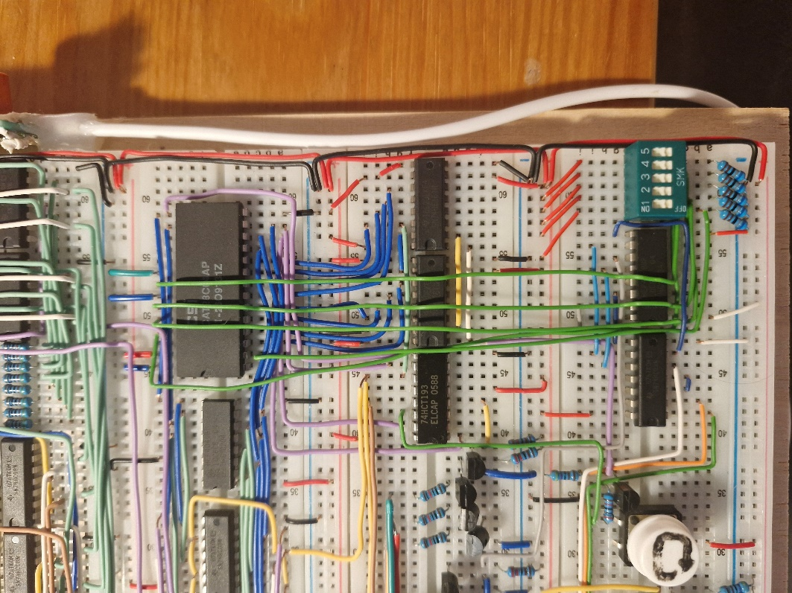

# Week 8. (21-28.04.2026)

The last week of the project, the last week of fun. So let's start:

**Adding DIP switch for song selection**

To ensure there are no undefined states I need to use "pull-down" resistors. When a given button is not pressed, the pin will be connected to ground (state 0), and when I switch it - voltage will reach the pin (state 1). Since I have 5 pins and a DIP switch with 5 switches, I need to use 5 resistors (one per pin), I used 6k8 resistors.

  

**Adding more songs**

I manually wrote 9 songs (+ tuning) that I know. They are:

- "Für Elise" - Ludwig van Beethoven (00000)
- "Hungarian Dance no.5" - Johannes Brahms (00001)
- "Toreador March" from "Carmen" overture - George Bizet (00010)
- "Waltz no.2" - Dmitri Shostakovich (00011)
- "Pussy cat, pussy cat, have you any wool" - folk song (00100)
- "Three little chickens" - folk song (00101)
- "Megalovania" - Toby Fox, Undertale (00110)
- "Freedom motif" - Toby Fox, Deltarune (00111)
- "Fischia il vento" - Italian song (01000)
- Tuning (11111)

I uploaded them to memory in such a way that song 1 starts at address 0, song 2 at address 256, song 3 - 512, etc. This way I can use the DIP switch functionality.

After testing, all songs work, everything plays nicely and finally works as it should. The numbers in parentheses in the above list symbolize the DIP switch setting.

**Completing the report**

Well, right now I'm finishing writing the report - the project officially comes to an end. I'm immensely proud that I had the opportunity to do this particular project. The funniest thing is that a year ago I never would have thought I was capable of doing such things. Everything changed at the end of the 4th semester, when I was watching the last lectures on "Digital Technology" - it was precisely these lectures that made me realize that physics, electronics and digital technology don't have to be so scary. Back then I started playing with microcontrollers, doing first projects on Arduino and ESP32, and it ended up with me diving deep and basing my engineering work on microcontrollers. All thanks to the great lectures from my instructor for "Digital Technology" and "Complex Digital Systems" - Dr. Jacek Długopolski. As a thank you for finding my path in life, I'm putting my project in the hands of the instructor - I believe it will serve for many years, go through a lot of students and perhaps convince some of them to try themselves in electronics or digital technology. You could say I'm a living example that it's possible!

Due to the nature of the project, below I'll attach a visual schematic of the circuit along with a detailed photo, so in case of failure I can quickly find the cause. I'll also include a list of components with the prices I managed to get them for (in case someone wants to replicate the project)

- [Components List](../components_list.md)
- [Final Circuit](../final_circuit.md)