# Tydzień 1. (3-10.03.2026)

Zacząłem od dokładnego rozpisania tego co chcę zrobić, aby prościej było to projektować, ale też żeby wiedzieć co kupić. Po wstępnym przelaniu pomysłu na kartkę miałem listę potrzebnych komponentów, i udałem się na zakupy. Jedyną wątpliwą rzeczą był sam dekoder, ale najpierw chciałem go zaprojektować aby wiedzieć ile i jakich układów kupić.

Początkowo dużo myślałem jak najlepiej zamodelować dekoder nut, czyli aby nie używać czterowejściowych ANDów i tym samym nie robić tego „łopatologicznie". Wpadłem na pomysł pogrupowania sygnałów:

_O N4 N3 N2 N1 - schemat nuty (O - symbolizuje oktawę, N4-1 - 4 bitowa liczba od 0 do 13 symbolizująca nutę lub sygnał STOP/PAUZA)_

_N4 N3 - 4 możliwe kombinacje (00, 01, 10, 11), traktuję jako numer grupy_

_N2 N1 - również 4 możliwe kombinacje (00, 01, 10, 11), traktuję jako numer nuty w grupie_

Tym sposobem sprawdzam w której z 4 grup jesteśmy i którą z 4 nut z tej grupy gramy. Następnie ANDuję sygnał grupy oraz nuty i wiem, którą nutę mam grać. Na każdą nutę potrzebujemy 3 bramki AND + ewentualnie NOT, ale ponieważ używam powyższego grupowania - nie muszę tworzyć osobnych ANDów dla grupy i nuty w grupie dla każdej z nut!

Na każdej grupie potrzebny jest jeden AND - czyli 4 bramki + 2 NOT (dla sprawdzenia sygnału 0), analogicznie jest dla każdej z 4 nut w grupie. Czyli na samo grupowanie potrzebuję 8 ANDów i 4 NOTy. Później łącze te wyjścia w kolejne bramki AND i sprawdzam którą nutę dostaję (czyli jak N4 N3 to 00 (grupa 0), oraz N2 N1 to 00 (0 nuta w grupie) to znaczy, że gram dźwięk C). Docelowo potrzebuję:

- 4 AND + 2 NOT (Grupa)
- 4 AND + 2 NOT (Nuta w grupie)
- 13 AND (Dla każdej nuty + sygnał STOP/PAUZA)

Sumarycznie 21 bramek AND i 4 bramki NOT.

Aby nie zapomnieć pomysłu i aby móc to w prosty sposób przedstawić prowadzącemu naszkicowałem wstępny układ dekodera nut:

  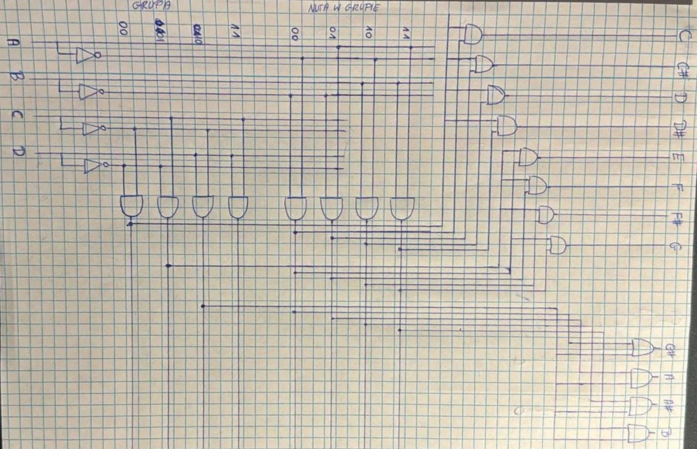

A tak układ prezentuje się w Multisimie:

  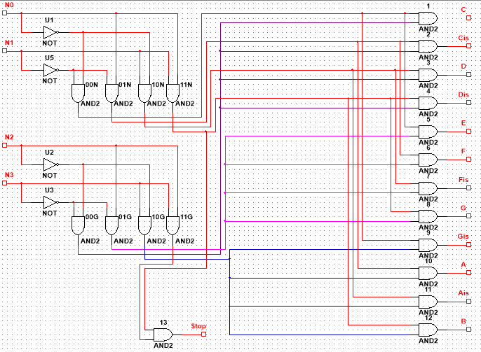

Jeśli chodzi o dekoder oktawy, to działa on bardzo prosto. Dla każdej nuty z poprzedniego dekodera:

- jeśli O daje sygnał 0 - chodzi o oktawę 4
- jeśli O daje sygnał 1 - chodzi o oktawę 5

Wykonanie jest banalne - dwie bramki AND, do każdej podpinam sygnał dla danej nuty oraz do jednej sygnał oktawy, a do drugiej - zanegowany sygnał oktawy. Dzięki temu jeśli sygnał będzie wychodził z tej pierwszej bramki to będzie to dźwięk z oktawy 5, a jeśli sygnał będzie wychodził drugiej bramki - będzie to dźwięk z oktawy 4.

Naszkicowałem również ten pomysł aby nie uciekł mi z głowy.

  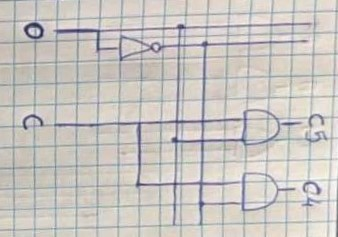

I tak należy powtórzyć 13 razy - dla każdej z 12 nut w oktawie i dodatkowo aby rozdzielić sygnał STOP i PAUZA.

A tak układ prezentuje się w Multisimie (tutaj bez STOP i PAUZA):

  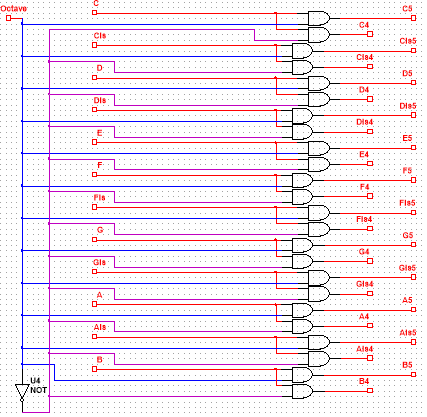

W tym przypadku wychodzi mi 26 bramek AND i 1 bramka NOT.

Korzystając z tego, iż mam dostęp do Multisima podłączę oba te dekodery i sprawdzę działanie rozwiązania:

  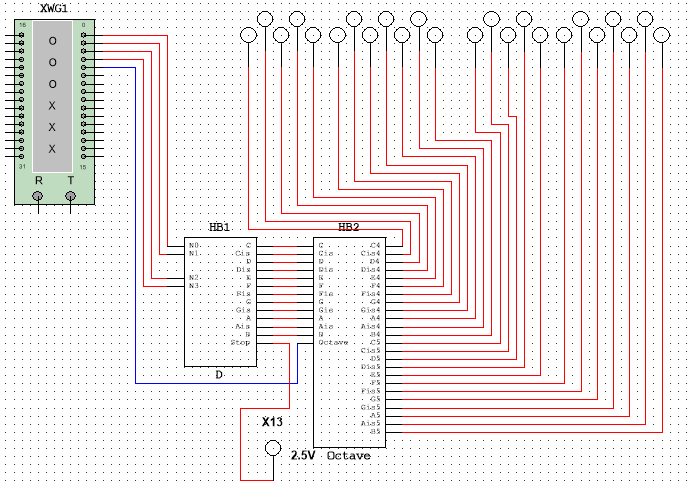

Korzystam z generatora słów, w którym znajduje się sekwencja idąca po kolei po nutach C4, Cis4 … Ais5, B5, STOP. Uruchamiam więc symulację:

  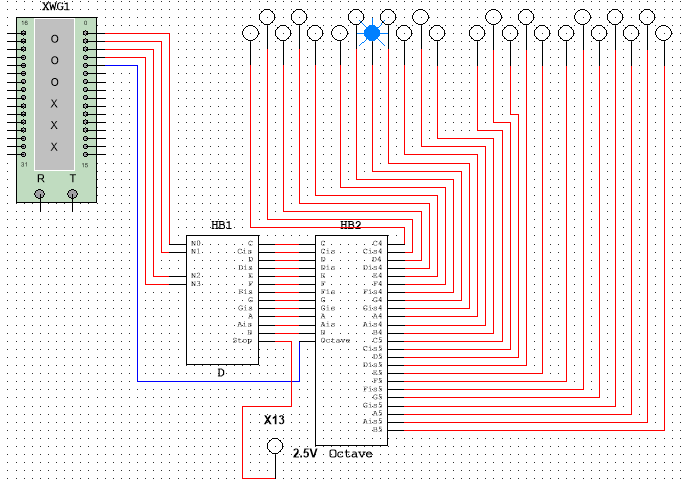

No i działa! Dźwięki idą po kolei, co widać na próbnikach. Zauważyłem jeden problem - gdy następuje zmiana dźwięku z B4 na C5, to pomiędzy zgaśnięciem próbnika B4 i zapaleniem próbnika C5 na ułamek sekundy zapala się również próbnik B5. Analogicznie w drugą stronę - przy zmianie z B5 na C4 na ułamek sekundy mignie próbnik B4. Bardzo mnie to zaciekawiło, gdyż to jedyne miejsca gdzie się tak dzieje. Zauważyłem, że to przy zmianie oktawy - dodam więc jeszcze parę nut do generatora słów tak, aby nuty naprzemiennie znajdowały się w innych oktawach. Po przetestowaniu jestem pewien, że moje podejrzenia były słuszne - próbniki wariują przy zmianie oktawy. Nie jestem pewien czym to jest spowodowane, same układy wydają się być poprawne - są na tyle proste, że aż można powiedzieć - nie do zepsucia. A jednak coś tutaj nie gra, muszę się zastanowić co może tu nie grać…

Moje pomysły:

- Po prostu Multisim robi opóźnienie i nie wykonuje symulacji poprawnie (co może być spowodowane słabym wydajnościowo laptopem)
- Generator słów robi opóźnienie i zmienia wartości poszczególnych bitów po kolei, a nie jednocześnie
- Jest jakiś problem w moim układzie, ale nie mam pomysłu jaki

Moje (najistotniejsze) próby rozwiązania:

- Wyeliminowałem pomysł z generatorem słów - zmienia wszystkie bity jednocześnie. Podpiąłem próbniki wprost do generatora słów i zmieniają się wszystkie razem
- Próbowałem dodać przerzutniki JK na wyjściach, aby aktualizowały stan na malejącym sygnale zegara - też nic nie dało
- Próbowałem też popodpinać dekodery pojedynczo (żeby potencjalnie dowiedzieć się w którym leży problem) do generatora słów. Działały bez problemów.

Nie mam pomysłu co może być problemem. Poczytałem o tym w Internecie i dowiedziałem się tylko (i aż), że zjawisko to nosi nazwę hazard/glitch logiczny. Fajne, nowe słowo do słownika ;)

Na ten moment się poddaję, spędziłem na szukaniu problemu zbyt wiele czasu, a pewnie okaże się, że to jedna z banalniejszych rzeczy… Tak czy inaczej, poruszę ten temat na konsultacji z prowadzącym, być może razem uda się coś wymyślić.

Po bitwie z dekoderem w Multisimie chciałem trochę odreagować i zacząć działać na fizycznym sprzęcie, więc czekałem i czekałem na paczkę z komponentami. Gdy paczka do mnie dotarła, od razu wziąłem się do roboty. Najpierw chciałem pobawić się licznikami, a do tego potrzebny był mi sygnał zegara. Włożyłem więc do płytki prototypowej zegar NE555 i ustawiłem go w tryb monostabilny, aby przyciskiem generować sygnał prostokątny. Do jego wyjścia podłączyłem diodę LED z rezystorem aby sprawdzić czy wszystko działa, i owszem - dioda zapalała się po wciśnięciu przycisku.

Następnie przystąpiłem do przeczytania dokumentacji układu 4 bitowego licznika SN74HC161, aby sprawdzić jak taki układ spiąć na płytce:

  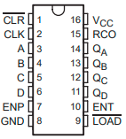

Jest to licznik liczący do góry z możliwością załadowania liczby na początku. Służą do tego piny A, B, C, D oraz zanegowany LOAD (Czyli jeśli na pinie 9 zostanie podane 0, licznik nie będzie liczył, lecz zapisze wartość z wejść A, B, C, D). Ponieważ ich nie używam, piny 3-6 podpinam do masy, a pin 9 do VCC. Analogicznie postępuję z pinem 1 (zanegowany CLR), który po dostaniu stanu 0 zresetuje licznik - podpinam do VCC. Pin 2 to wejście zegara, więc podpinam go do wcześniej złożonego układu. Piny 7, 10 i 15 (ENP, ENT i RCO) służą do łączenia liczników kaskadowo oraz do załączania liczenia. Na razie bawię się jednym licznikiem więc piny 7 i 10 podłączam do VCC, a 15 do masy. Zostały piny zasilające oraz piny 11-14, które są wyjściem licznika w takiej postaci, że Qa to najmłodszy bit, a Qd to najstarszy bit. Podłączam do tych wyjść diody led przez rezystory i obserwuje działanie licznika.

Działa wspaniale, diody ładnie sobie migają, licznik liczy, ale po co liczyć od 0 do 15, skoro można od 0 do 255 ;)

Korzystając z tego, iż do docelowego projektu potrzebne będzie więcej liczb, wyposażyłem się nie w jeden, a dwa takie liczniki. Podłączam więc drugi licznik w praktycznie taki sam sposób, jednak aby realizowały one liczenie do 255 (a nie każdy do 15) trzeba je ze sobą połączyć. Do tego służą wcześniej wspomniane piny ENT i RCO. Kiedy licznik osiągnie wartość 15 (czyli 1111, czyli stan wysoki na wszystkich czterech pinach wyjściowych) wyjście RCO (Ripple Carry Output) zmienia swój stan z niskiego na wysoki. Aby licznik mógł liczyć, piny ENP (Enable Parallel) oraz ENT (Enable T) muszą mieć stan wysoki, oraz licznik musi dostać narastający sygnał zegara. Korzystając z tych własności, podłączając wyjście RCO licznika A do wejścia ENT licznika B „utworzymy" licznik 8 bitowy. Tak też zrobiłem, odłączając pin 15 licznika A od masy i podłączając go do pinu 10 licznika B.

  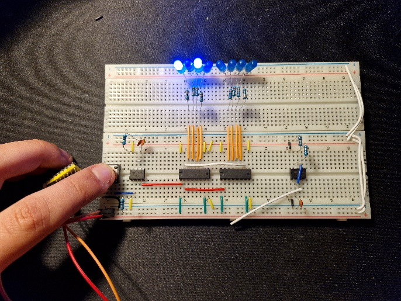

  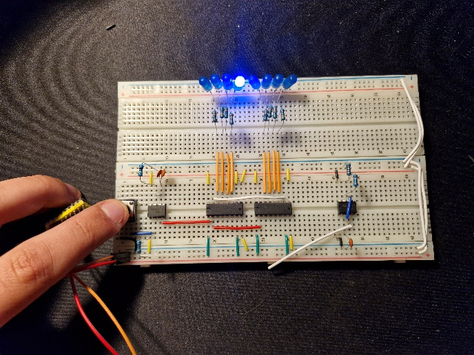

Na ten moment nasz układ jest w stanie liczyć od 0 do 255, wystarczająco na początek. Monotoniczne jednak jest wciskanie przycisku do generowania sygnału zegarowego, toteż włożyłem do breadboarda kolejny zegar NE555. Tym razem jednak ustawiłem go w tryb astabilny, czyli aby generował sygnał sam a nie ręcznie. Do tego potrzebne są dwa rezystory i kondensator. Nie chcę wchodzić w dokładny opis budowy i działania układu NE555, ale należy wiedzieć, iż generuje sygnał prostokątny, a przełączenie wyjścia (z 0 na 1 i na odwrót) zależne jest od napięcia na kondensatorze - gdy osiąga 2/3 VCC przełącza na stan niski, a gdy osiąga 1/3 VCC przełącza na stan wysoki. Sam kondensator ładowany jest przez R1 + R2, a rozładowywany tylko przez R2, dlatego czasy ładowania i rozładowania są różne. Czas każdego stanu możemy określić wzorami:

$$
t_{high} = 0.693(R_1 + R_2)C
$$

$$
t_{low} = 0.693(R_2)C
$$

Gdzie R1, R2 - rezystory, C - kondensator. Wartość 0.693 wynika z logarytmicznego charakteru ładowania i rozładowania kondensatora w obwodzie RC. Mając te oba czasy jesteśmy w stanie wyliczyć okres:

$$
T = t_{high} + t_{low} = 0.693(R_1 + 2R_2)C
$$

A zarazem i częstotliwość:

$$
f = \frac{1}{T} \approx \frac{1.44}{(R_1 + 2R_2)C}
$$

Czyli wraz ze zwiększeniem wartości rezystorów i kondensatora częstotliwość się zmniejsza. Zastanówmy się jeszcze nad wypełnieniem (Duty Cycle), gdyż też odgrywa ono istotną rolę. Jest to stosunek czasu trwania sygnału wysokiego do okresu:

$$
D = \frac{t_{high}}{T} = \frac{R_1 + R_2}{R_1 + 2R_2}
$$

Czyli wypełnienie zależy tylko od R1 i R2. Zakładam, że do zasilenia całego układu będę używał napięcia ~5V, także myślę, iż zestaw rezystorów o wartościach R1=1k, R2=10k będzie odpowiedni (zarówno do parametrów zasilania jak i wypełnienia, które wyniesie około 52%).

Obliczmy więc pojemność kondensatora potrzebnego do wygenerowania sygnału o częstotliwości np. 1Hz

$$
1\text{ Hz} = \frac{1.44}{(1000\Omega + 2 \cdot 10000\Omega)C} \Rightarrow C \approx 68\,\mu\text{F}
$$

Największy kondensator jaki mam aktualnie przy sobie to 100nF, łączenie ich nie ma żadnego sensu. Na razie wsadzę co mam aby sprawdzić czy układ działa, a docelowo zamienię na inny kondensator.

Układ działa, co prawda ledy migają bardzo szybko, ale skorzystałem (chyba pierwszy raz) z funkcji nagrywania w zwolnionym tempie w moim telefonie aby sprawdzić czy aby na pewno wszystko liczy się jak powinno. Wstępnie jestem w stanie ustalić - działa!

Zajmijmy się więc pamięcią EEPROM. Ten z którego korzystam to CAT28C64A, który przechowuje 8192 liczb 8 bitowych. Działa on w trybie równoległym, co jest dobre dla mojego projektu - wystarczy że na 8 pierwszych linii adresowych podam sygnał z liczników, pozostałe podepnę do masy (aby były traktowane jako wartość 0), a uzyskam na wyjściu liczbę 8 bitową którą mogę podłączyć (dla testu) do moich ledów których używam. Najpierw jednak zajmę się programatorem, gdyż pamięci EEPROM zwykle są „zerowane" - wszystkie bity na wszystkich adresach są ustawione na 1. Uzyskałbym tylko 8 ciągle świecących ledów, co nie tylko nie pozwoli mi przetestować działania, ale też nie jest zbyt efektowne.

Biorę więc kolejną płytkę prototypową i składam programator!

  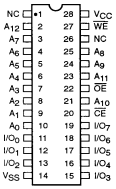

Napisałem prosty program który odczytuje wartość pamięci na danym adresie, zapisuje wartość na danym adresie pamięci oraz wypisuje zawartość całej pamięci. Realizuje się to poprzez komendy READ, WRITE i DUMP (z odpowiednimi argumentami) na porcie szeregowym płytki. Docelowo chciałbym również napisać program w Pythonie, który rozszerzy te funkcjonalności łącząc się z płytką poprzez właśnie port szeregowy, i będzie miał możliwość m.in. automatycznego zapisania zawartości pliku na komputerze do pamięci EEPROM.

Zauważyłem natomiast minus mojego programatora. Mianowicie przy jakiejkolwiek operacji na pamięci muszę upewnić się, iż wszystkie przewody są dobrze podopinane zarówno do Arduino jak i do breadboarda. Ponadto, lekki ruch układu może spowodować poluzowanie się przewodu a co za tym idzie - wartości zostają źle zapisane. Jest to oczywiście spowodowane samą budową - przewody nie są wpięte na stałe i mogą się poruszyć, co jest nieakceptowalne w dalszej perspektywie. Dlatego właśnie muszę zlutować ten układ na uniwersalnej płytce PCB - myślę, że zapewni to o wiele lepszą dokładność. Na ten moment niestety nie mam gniazda DIP28 do swobodnego wyjmowania i wkładania pamięci do układu (bezsensowne byłoby przylutowanie EEPROMa do płytki), toteż odkładam to na dalszy plan.

Po wgraniu przykładowych wartości do pamięci wracam do płytki z licznikami i próbuję to ładnie ze sobą spiąć.

  

Piny A0-A12 to linie wejścia. Ponieważ mam licznik 8 bitowy, do linii A0-A7 podłączam wyjścia licznika, a linie A8-A12 – do masy (będą wtedy traktowane jako 0). Piny I/O_0 - I/O_7 to linie wyjścia, które podłączam wprost do ledów, które wcześniej były podpięte do liczników. Piny NC nadal zostają niepodłączone, VCC i VSS podłączam odpowiednio do VCC i masy, a jeśli chodzi o piny sterujące – CE i OE podłączam do masy (traktowane jako 0), a WE – do VCC (traktowane jako 1). Dzięki temu pamięć będzie ustawiona zawsze w trybie do odczytu. 

Uruchamiam układ i sprawdzam działanie:

  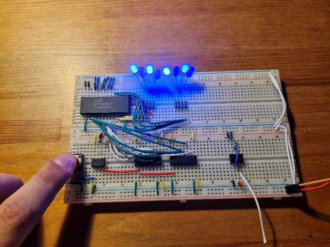

  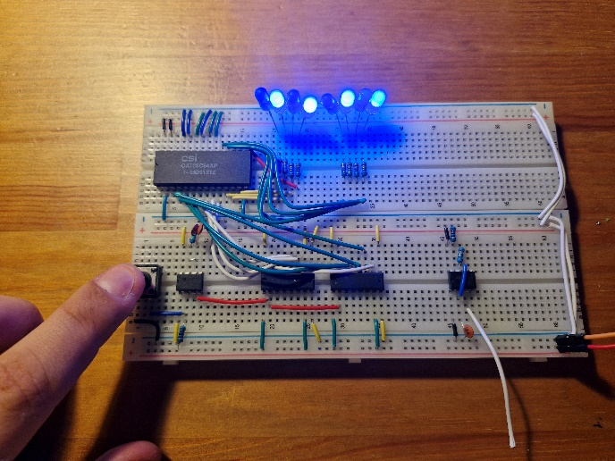

Jak widać układ spełnia na ten moment swoje zadanie. Licznik przy każdym cyklu zegara odnosi się do kolejnej komórki pamięci, której wartość jest wyświetlana na diodach led. Przy umyślnym ułożeniu wartości w pamięci można zrobić ładny pokaz światełek. Mi jednak (nie)stety to nie wystarczy, więc przeskakuję część związaną z dekoderem nut i zajmuję się końcową częścią układu, czyli generatorem dźwięku.

Od dawna w mojej szafie walały się stare słuchawki nauszne z połamanym przewodem (w sumie to one zainspirowały mnie do stworzenia tego projektu), przy użyciu małej ilości „przemocy" na nich udało mi się dostać do ich głośnika. Po zdjęciu izolacji z przewodów i zaciśnięciu na nich męskich pinów już można było go wpiąć do płytki prototypowej. Wziąłem więc kolejną już płytkę w dłoń i złożyłem na niej tożsamy zegar NE555 w trybie astabilnym, a następnie do wyjścia sygnału wpiąłem głośnik. Po wpięciu zasilania mamy pierwszy sukces - głośnik żyje i wydaje charakterystyczny dźwięk fali prostokątnej.

  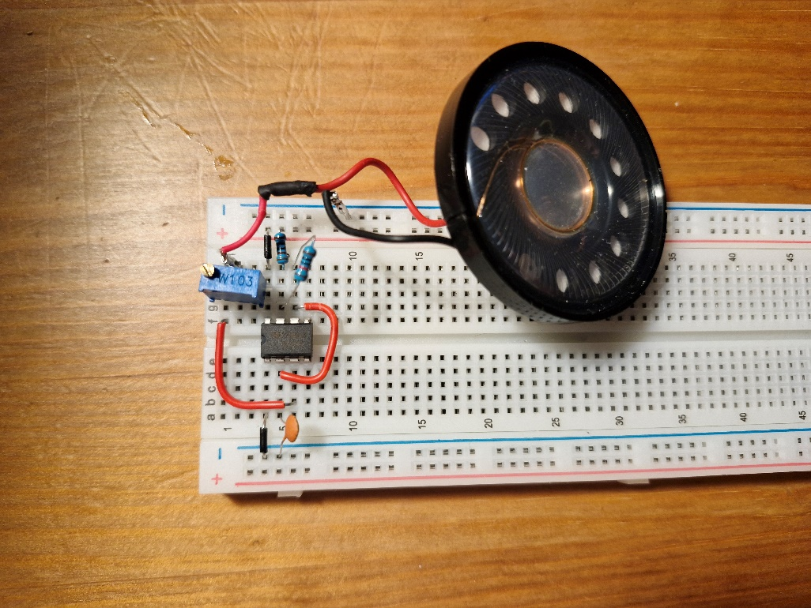

Dwie uwagi: głośnik trzeszczy + gra za głośno. Dodałem więc potencjometr precyzyjny (tylko taki mam pod ręką) o wartości 10k i wpiąłem go tuż przed głośnikiem - dzięki temu mogę regulować głośność. Trzaskanie jednak nie ustało, więc postanowiłem zmienić zasilanie na mniejsze - z 5V na 3.3V - a problem zniknął. Będę musiał to dokładnie zbadać, być może da się to załatwić jakoś mało inwazyjnie.

Wszystko fajnie, ale docelowo głośniczek ma wydawać szereg dźwięków, a nie tylko jeden. Aby tak się działo, trzeba zająć się nie samym głośnikiem, a generatorem. Gdy częstotliwość zegara będzie mniejsza/większa, analogicznie częstotliwość dźwięku będzie mniejsza/większa.

Częstotliwość zegara można regulować poprzez R1, R2 i C. Najsensowniej będzie ustalić jedno R1 i C, a zmieniać R2. W takim razie wyjmuję rezystor 10k pełniący rolę R2, a na jego miejsce wstawiam potencjometr precyzyjny 100k.

  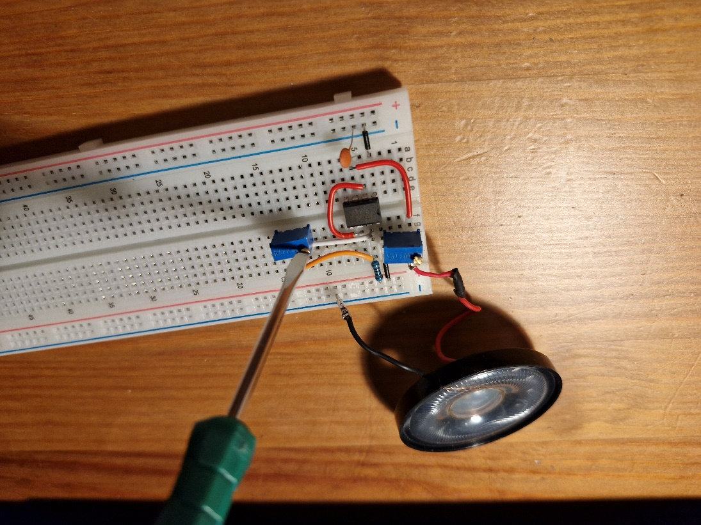

Po podłączeniu zasilania i ruszania potencjometrem dźwięk faktycznie się zmienia. Podjąłem nawet próbę wystrojenia dźwięku przy pomocy aplikacji na telefonie, jednak przy takim potencjometrze trzeba mieć naprawdę stabilną rękę - mały ruch i dźwięk jest nieczysty. Myślę, że docelowo lepszym rozwiązaniem będzie wstawienie tam zamiast jednego dużego potencjometru zwykły rezystor wraz z mniejszym potencjometrem. Do tego jednak będzie potrzebne wyznaczenie R2 dla każdego dźwięku, a następnie dobranie do nich rezystorów - odkładam to na dalszy plan.

Docelowo dany dźwięk ma grać tylko wtedy, kiedy z dekodera wyjdzie wartość 1 dla danego dźwięku. Aby miało to prawo działać, układ musi mieć JAK załączyć dany układ rezystorów do zegara. Można to łatwo załatwić tranzystorami - przed potencjometrem wpinam taki właśnie tranzystor NPN tak, że nóżka emiter jest przy nóżce potencjometru a nóżka kolektor podłączona jest to zegara. Teraz po podłączeniu zasilania głośnik nie wydaje żadnego dźwięku co jest logiczne, bo dopiero po podaniu prądu na bazę tranzystora taki dźwięk się wydobędzie.

Postanowiłem zrobić mały eksperyment - podpinam bazę do jednego z wyjść pamięci EEPROM, na przykład najstarszy bit. Dzięki temu mogę zasymulować co się stanie, jak dany układ rezystorów zostanie załączony przez dekoder. Uruchamiam więc cały układ z licznikami (uprzednio podłączając zegar w trybie monostabilnym aby "przeklikiwać" przez kolejne adresy) i obserwuję (a raczej wysłuchuję) efekty.

  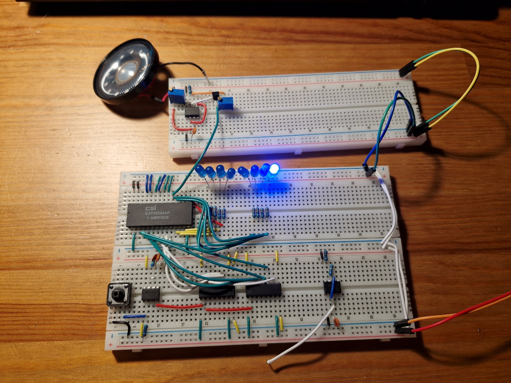

Wszystko działa jak powinno! Gdy dioda led świeci na najstarszym bicie, głośnik wydaje dźwięk. Ponieważ mam jeszcze chwilę, dołożę drugi potencjometr i podłączę go analogicznie jak poprzedni, jednak podłączę go do drugiego w kolejności najstarszego bitu. Przy okazji dostroję oba dźwięki tak, aby na jednym potencjometrze było C, a na drugim D.

  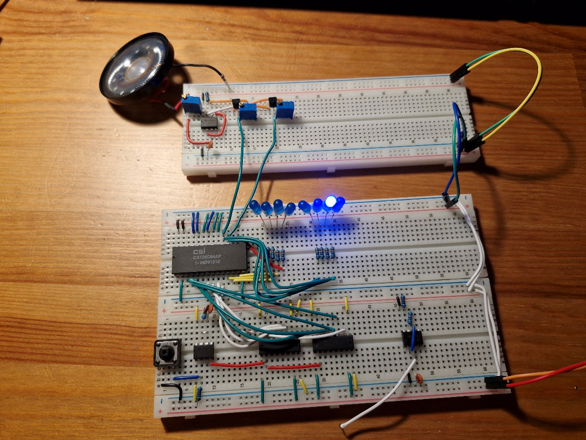

Również działa jak powinno! Zauważyłem jednak jedną rzecz - gdy dwie diody (które odpowiadają podaniu sygnału na bazy tranzystorów) świecą się jednocześnie, dźwięk wydobywany z głośnika to nie jest jednocześnie połączony dźwięk C i D (interwał), lecz zupełnie inny pojedynczy dźwięk. Jest to logiczne, gdyż po załączeniu dwóch zestawów rezystorów, całkowity opór jest inny - a więc i dźwięk jest inny. Gdybym chciał tworzyć interwały bądź akordy, musiałbym najpewniej złożyć więcej generatorów. Oczywiście nie brakuje mi układów NE555, jednak skomplikuje to dodatkowo układ, a zarazem zapis nut w pamięci EEPROM jak i odczyt tych wartości. Na ten moment jeden dźwięk jednocześnie w zupełności wystarczy.

Będąc już przy pamięci EEPROM, zastanawiałem się jak poradzić sobie z długością nut. Najbardziej „łopatologicznym" sposobem byłoby wpisać daną nutę X razy po sobie, dzięki temu słyszalny dźwięk będzie trwał dłużej. Jednak istnieje bardzo duża możliwość, że przerwy pomiędzy „zmianą" dźwięku (czyli zmianą adresu przez liczniki) będą na tyle długie, iż będą słyszalne. Myślałem nad innym rozwiązaniem - użyć licznika dekrementującego. Zapis w pamięci byłby inny, gdyż zamiast nut po kolei byłoby na przemian - długość nuty, nuta, długość nuty, nuta itd. Bardzo łatwo rozróżnić która wartość jest która - zakładając powyższy sposób, na parzystych adresach są długości i na nieparzystych - nuty, a tak się składa, iż symbolizuje to najmłodszy bit w liczniku. Jeśli odczytujemy długość, wartość z pamięci EEPROM wrzucamy do licznika malejącego i odczytujemy nutę (podając sygnał na liczniki adresu). Następnie sygnał zegara kierujemy do licznika malejącego, który powoli odmierza sobie do 0000 (w tym samym czasie sygnał poszedł na dekoder i głośnik gra). Gdy dojdzie do końca, sygnał zegara znów kierujemy na liczniki adresu, znów zaczytujemy długość nuty do licznika malejącego i całość zaczynamy od początku.

Jest to na razie tylko pomysł który muszę skonsultować, ale wydaje mi się iż ma on sens i jest warty spróbowania. Gdy będę pewny, zamodeluję taki układ w Multisimie.

Na ten tydzień tyle. Muszę stwierdzić, iż był on naprawdę pracowity i jestem z siebie dumny.

## TODO (Tydzień 1)

- Rozwiązanie hazardu w Multisimie, a potem dokupienie odpowiednich układów bramek do dekodera i jego złożenie
- Dokupienie gniazda DIP28 do programatora a następnie jego zlutowanie na PCB
- Dokupienie większych kondensatorów
- Skonsultowanie pomysłu z długością nut, zamodelowanie w Multisimie, kupienie licznika i odpowiednich układów
