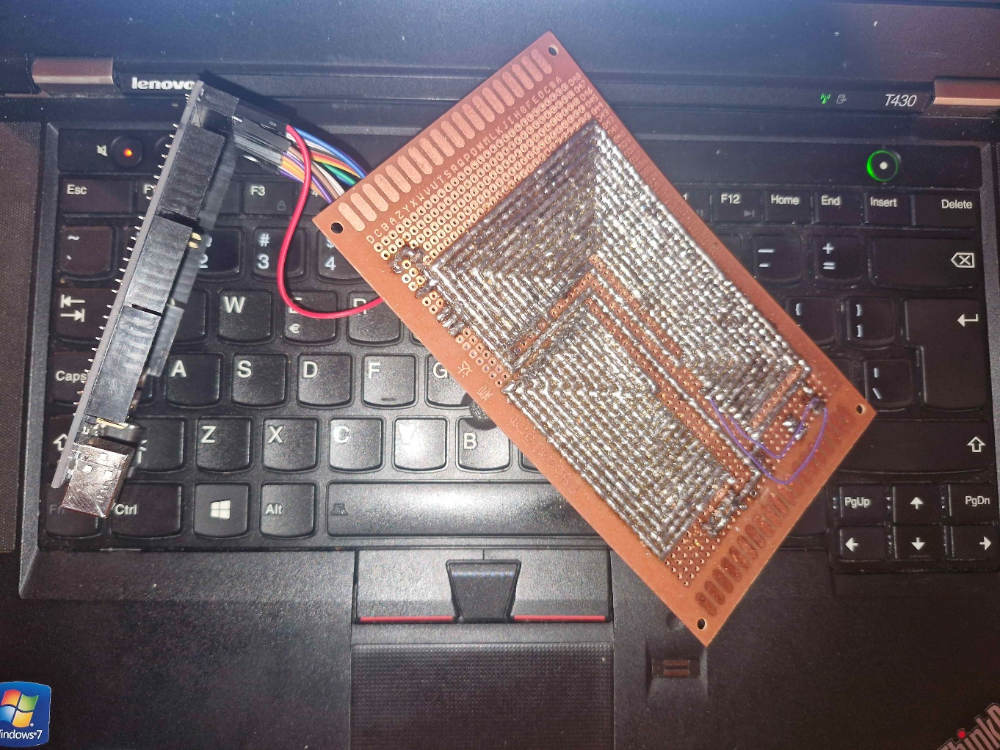
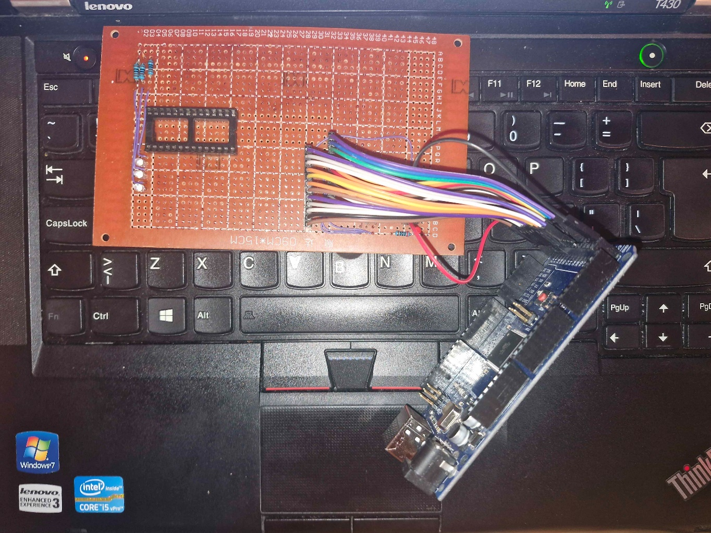
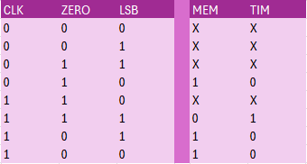
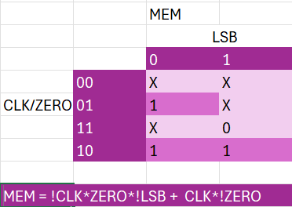
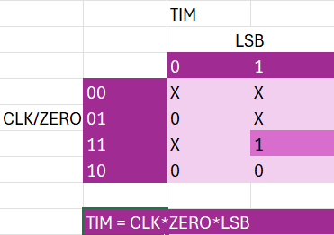
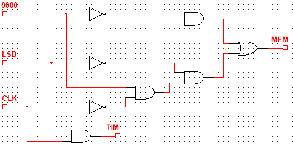
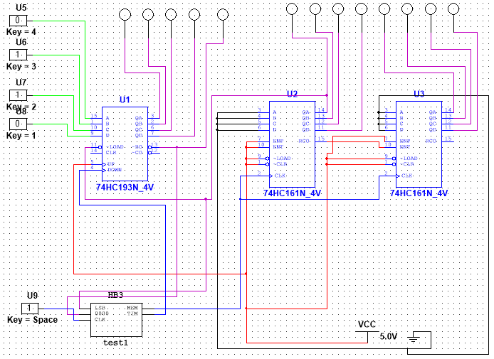

# Tydzień 2. (10-17.03.2026)

Ten tydzień był znacząco mniej pracowity niż poprzedni, gdyż starałem się rozwiązać problemy z poprzedniego. A więc:

**Rozwiązanie hazardu w Multisimie**

Niestety problemu na razie nie udało się rozwiązać, głównie ze względu na krótką konsultację. Starałem się jeszcze coś pokombinować (wyjąć układy z podukładów, dołożyć przerzutniki na wyjściach), ale bezskutecznie. Problem odkładam na kolejne tygodnie, być może uda się trochę dłużej porozmawiać o problemie na zajęciach.

**Dokupienie odpowiednich układów bramek do dekodera, kupienie gniazda DIP28 do programatora oraz dokupienie większych kondensatorów**

Udało mi się znaleźć stacjonarny sklep z elektroniką w Krakowie i postanowiłem się do niego wybrać. Dorwałem w nim bramki NOT potrzebne do dekodera, gniazdo DIP28 oraz kondensatory 1μF i 10μF. Dzięki temu jestem w stanie zrobić trochę więcej i rozwiązać część problemów z zeszłego tygodnia.

Dzięki kondensatorom jestem w stanie doregulować główny zegar tak, aby miał o wiele niższą częstotliwość. Użyłem więc R1=1k i C=1μF, a zamiast R2 wstawiłem potencjometr precyzyjny 100k z rezystorem 22k - dzięki temu mogę regulować częstotliwość wedle upodobania. Docelowo jednak zamiast potencjometru precyzyjnego chciałbym tam wstawić zwykły potencjometr, gdyż trzeba się dużo „nakręcić" zanim zmiana w częstotliwości będzie widoczna gołym okiem.

Mając w ręku gniazdo DIP28 jestem już w stanie wykonać docelowy programator EEPROM, a więc…

**…a następnie jego zlutowanie (programatora) na PCB**

Ponieważ zależało mi na komforcie wkładania i wyjmowania pamięci do programatora oraz jak najbardziej stabilnych połączeniach (i przy okazji chciałem poćwiczyć lutowanie) zdecydowałem się na zrobienie długich ścieżek. Dzięki temu nie trzeba się przeciskać między przewodami aby włożyć/wyjąć pamięć, oraz same przewody połączeniowe do Arduino są obok siebie i nie działa na nie aż taka duża siła (dzięki temu stabilnie siedzą w gniazdach). Dołożyłem również parę diod LED - jedna do sprawdzenia zasilania i trzy do pinów sterujących WE, OE i CE - aby łatwiej sprawdzić działanie programatora. Całość zajęła mi dwie noce, a ilość zużytej cyny w odsysaczu oraz „brzydkich" słów gdy n-ty raz musiałem poprawiać ścieżkę bo zwarła się z sąsiadującą - bezcenna. Z drugiej strony, widać, że ze ścieżki na ścieżkę szło mi coraz lepiej i luty były ładniejsze. Mimo wszystko, cieszę się iż wreszcie miałem możliwość pobawienia się z lutownicą w tak ambitny sposób - jest to doświadczenie którego nie da się nigdzie kupić i na pewno przyda się w przyszłości. Sam programator działa i problem z błędnymi odczytami i zapisami zniknął.

  

  

**Skonsultowanie pomysłu z długością nut, zamodelowanie w Multisimie, kupienie licznika i odpowiednich układów**

Przedstawiłem mój pomysł i uzyskałem aprobatę prowadzącego, biorę się więc do działania. Najpierw zamodelowałem mój układ w Multisimie, aby upewnić się że robi to co powinien, oraz co jeszcze należy dokupić. Do pełni szczęścia potrzebna była mi jednak pamięć z której mógłbym normalnie korzystać tak jak ze zwykłego EEPROMa. W programie znalazłem 3 rozwiązania:

- 1:1 układy pamięci EEPROM - owszem są, ale służą one tylko do celów schematowych i nie mają żadnej funkcjonalności. Odpada.
- Generator słów - on już ma możliwość przechowywania informacji, ale odczyt obsługiwany jest przez sam generator - nie da się zrobić tak, żeby dostać się do danego adresu poprzez np. liczniki. Również odpada.
- Układ 2K8RAM - on już jest pełnoprawną pamięcią, jednak aby zapisać do niej dane trzeba użyć generatora słów przed testowaniem układu. Dla dłuższych sekwencji byłoby to problematyczne.

Postanowiłem pójść na „łatwiznę" i użyć 4 przycisków, które pełnią rolę odczytanych informacji z pamięci. Po ustawieniu odpowiedniej wartości na tychże przyciskach wartość jest zaczytywana do licznika malejącego, który następnie odmierza do 0. Kiedy tak się stanie, sygnał zegara musi iść na układ liczników pamięci, a następnie po dwóch sygnałach znów wrócić na licznik czasu. Aby tak się działo, muszę zamodelować sterownik, który pozwoli mi kierować sygnał na odpowiednie liczniki w zależności od stanu licznika czasu i tego, którą wartość odczytujemy z EEPROM (nuta czy czas). W tym celu skorzystam z wiedzy którą pozyskałem na „Technice Cyfrowej", i wykonam minimalizację tablicami Karnaugh:

  

Na początku jednak rozpisuję samo działanie mojego sterownika przy pomocy kodu Gray'a. Oznaczenia: CLK - sygnał zegara, ZERO - sygnał BORROW z licznika czasu (czyli czy doszedł do 0000, UWAGA - jest active LOW, czyli będzie miał wartość 0 gdy dojdzie do 0000), LSB - Least Significant Bit w licznikach pamięci (czyli czy odczytuje czas czy nutę), MEM/TIM - czy sygnał zegara idzie na liczniki pamięci/czasu.

Suma summarum - sygnał zegara idzie na licznik czasu tylko wtedy, gdy licznik ten nadal liczy (ZERO ma wartość 1, czyli nie doszedł do 0000) i jednocześnie LSB jest na 1 (czyli gra nuta). Gdy jednak licznik doszedł do 0, nie ważne jaka jest wartość LSB - sygnał idzie na licznik pamięci (bo i tak musi przejść bit 1 -> 0 i 0 -> 1). Tak samo się dzieje, gdy LSB ma wartość 0, a ZERO wartość 1 (czyli licznik czasu ma w sobie wartość, a licznik pamięci jest na czasie nuty), ale wtedy kiedy CLK jest na 0. W mojej opinii to może zadziałać, przystąpmy więc do minimalizacji:

  
  

Uzyskaliśmy dwie funkcje, dzięki którym mogę zrealizować układ. Potrzebne będą na pewno 3 bramki NOT, jeden OR i kilka ANDów. Przystępuję więc do zrealizowania sterownika w Multisimie:

  

Zamodelujmy resztę układu - liczniki/przyciski itp. aby można było przetestować działanie sterownika:  

  

Kolorem czerwonym i czarnym oznaczyłem odpowiednio prąd i masę. Kolorem niebieskim - sygnał zegara, fioletowym - wyjścia liczników (podpięte do próbników oraz sterownika) a zielonym - sygnał z przycisków. Po przetestowaniu stwierdzam, iż układ działa zgodnie z założeniem.

Korzystając z wizyty w sklepie elektronicznym zakupiłem 4 bitowy licznik malejący, nie mieli jednak układów bramek jakie mnie interesowały (albo też w jakiej cenie by mnie interesowały). Już myślałem o poddaniu się na ten moment i dokupieniu bramek przez internet w późniejszym terminie, jednak przypomniałem sobie dwie rzeczy:

- W projekcie przynajmniej jedna jego część musi być wykonana niskopoziomowo (pół żartem pół serio, właściwie chyba cały mój projekt jest niskopoziomowy 😉)
- Mam zestaw tranzystorów, które miałem użyć docelowo do układu sterującego częstotliwością dźwięku

A czemu by nie zrobić bramek z tranzystorów? W końcu mój układ jest stosunkowo mały względem liczby bramek, a zawsze to jakieś dodatkowe doświadczenie! Zabieram się więc do pracy, a tak właściwie to do szukania schematów aby móc z nich skorzystać do budowania moich bramek (tak, piszę to po czasie, próbowałem ułożyć coś samemu i spaliłem dwa tranzystory). Natrafiłem na bardzo pomocny film:

<https://www.youtube.com/watch?v=I6ZyZPJ0MXM> (Link aktywny na dzień 4.04.2026)

Przedstawia on jak takie bramki należy budować właśnie przy użyciu tranzystorów. Korzystając z tej wiedzy dopiero teraz zabieram się do pracy.

Nie udało mi się dokończyć układu na czas, także muszę odłożyć to na następny tydzień.

Na ten tydzień tyle. Mniej pracowity niż poprzedni, ale udało się zrobić stosunkowo sporo.

## TODO (Tydzień 2)

- Rozwiązanie hazardu w Multisimie, a potem dokupienie odpowiednich układów bramek do dekodera (AND) i jego złożenie
- Dokończenie układu sterownika zegara na tranzystorach a następnie złożenie całego układu
