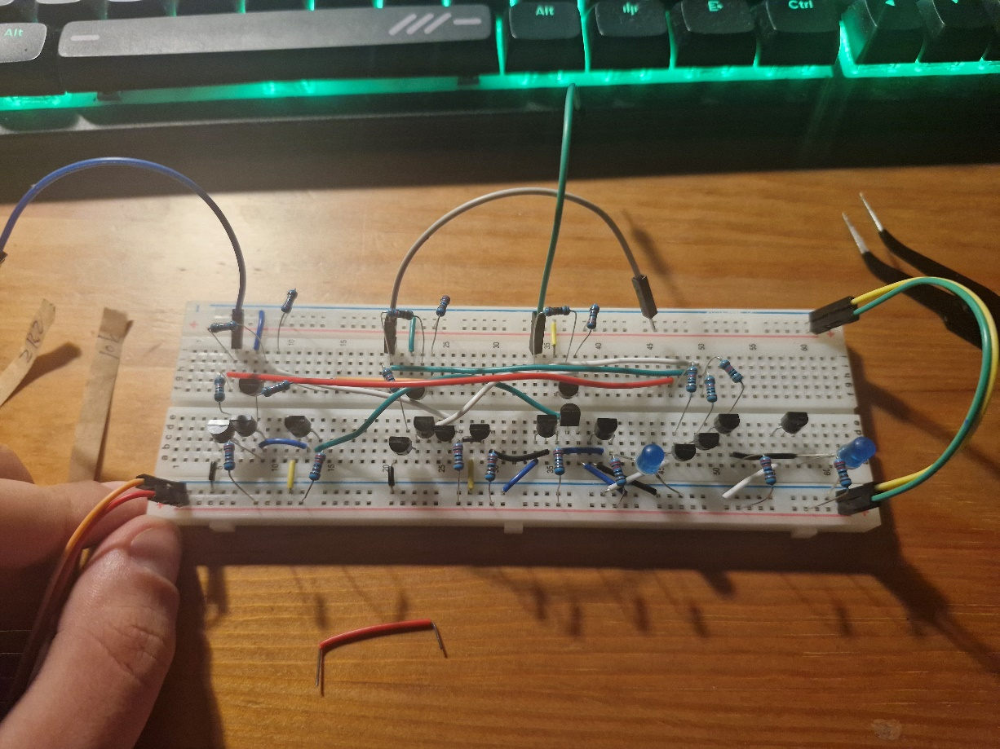
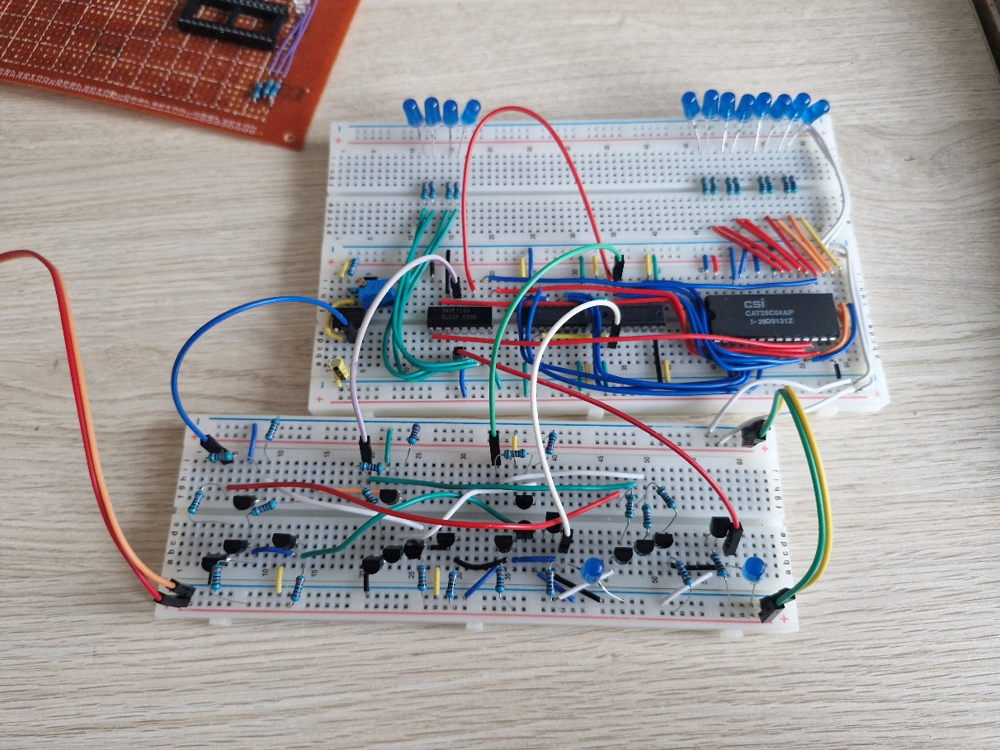
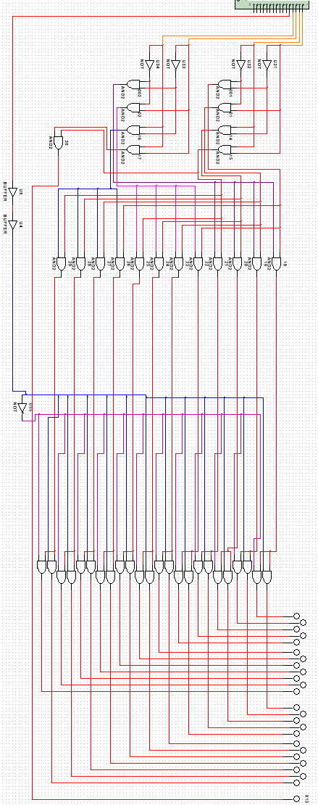

# Tydzień 3. (17-24.03.2026)

Właściwie od razu po powrocie z zajęć siadam do tych tranzystorów bo aż jestem ciekaw czy się uda:

<u>„dokończenie układu sterownika zegara na tranzystorach a następnie złożenie całego układu"</u>

Skończyłem układ, nie bawiłem się jeszcze w ładne docinanie przewodów i nóżek, także na razie jest to jedna wielka pajęczyna:

  

Co ciekawe, udało się zredukować dwie bramki dwuwejściowe w jedną trójwejściową, to tylko kwestia dołożenia jednego tranzystora - warto wiedzieć na przyszłość.

Sprawdźmy więc czy działa:

  

Było trochę debugowania (głównie przez stykające się rezystory + udało mi się trochę pomieszać połączeń przy bramkach) ale sytuacja opanowana i układ działa prawie tak samo jak w Multisimie! Prawie, bo zamiast ręcznego ustawiania danych przyciskami, podłączyłem do licznika wyjścia pamięci EEPROM (po uprzednim wgraniu przykładowych danych). Można więc powiedzieć, że podwójny sukces! Uporządkuję więc „pajęczynkę" jaką popełniłem podczas składania sterownika (jestem perfekcjonistą i boli mnie w oczy).

Od razu lepiej… Znowu trochę zabawy z debugowaniem ale układ działa tak jak wcześniej, także ten podpunkt z TODO mam z głowy!

<u>„rozwiązanie hazardu w Multisimie, a potem dokupienie odpowiednich układów bramek do dekodera (AND) i jego złożenie"</u>

Na poprzednich zajęciach udało się znaleźć dłuższą chwilkę na konsultację o hazardzie. Po wyjęciu układu z podukładów, uporządkowaniu i rzuceniu okiem udało się zlokalizować prawdopodobny problem - sygnał oktawy z EEPROM dociera szybciej na drugą część dekodera. Po przemyśleniu ma to sens - N0-N4 muszą jeszcze przejść przez dekoder nut, a dopiero potem na dekoder oktawy. Należy więc lekko opóźnić sygnał oktawy wychodzący z EEPROM np. przy użyciu bufora. Po jego dodaniu hazard znika, a cały układ śmiga jak powinien! 

  

Znam już rozwiązanie problemu, ale nie będę implementował go docelowo od razu - być może będzie okej? Jeśli będzie potrzeba dodam bufor, który może nawet uda się zastąpić kilkukrotnym przejściem sygnału przez bramki NOT, które dodadzą lekkiego opóźnienia.

Na ten tydzień tyle. Teraz mogę zająć się implementacją dekodera, ale żeby do tego przejść muszę mieć bramki w układach (robienie ich na tranzystorach będzie czaso- i miejscochłonne). Może i nie udało się zrobić dużo rzeczy, ale udało się wyczyścić ścieżkę do rozpoczęcia budowy dekodera!

## TODO (Tydzień 3)

- Dokupienie odpowiednich układów bramek do dekodera (AND) i jego złożenie

