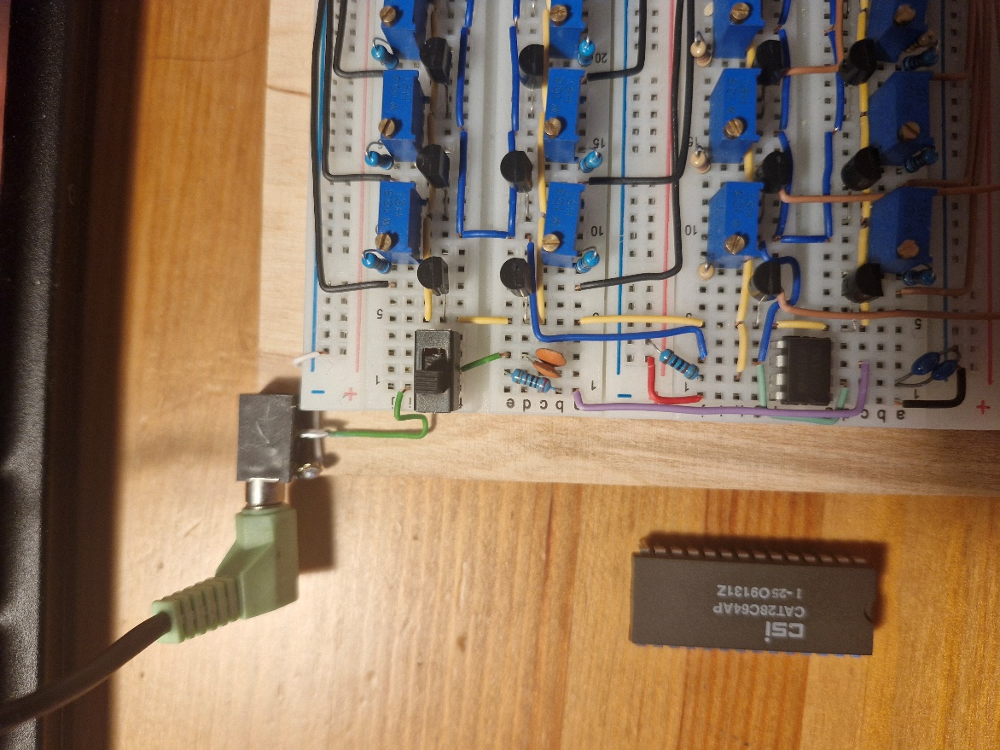
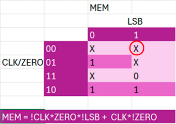

# Tydzień 7. (14-21.04.2026)

W tym tygodniu zostały mi właściwie rzeczy „kosmetyczne", a więc:

**Dolutowanie gniazda jack**

Ponownie wybrałem się na zakupy do sklepu elektronicznego po gniazdo jack. Niestety dostępne były tylko mono, ale no cóż, biorę co jest.

Nie mam do niego żadnej dokumentacji, są tylko 3 piny które niezbyt wiem jak działają. Z drugiej strony to tylko gniazdo jack - jeden pin musi być +, drugi -, ale co robi ten 3? Czyżby jednak to było gniazdo stereo?

Skorzystałem z multimetru który już do mnie dotarł a zamówiłem go przy okazji mierzenia pojemności kondensatora \*ekhm\* „100nF" tydzień temu. Ma on też tester ciągłości więc nada się idealnie.

Wybadałem piny: ten który zwierał z metalową obudową gniazda to masa, środkowy to +, a ostatni to pin do sprawdzenia czy do gniazda jest włożony aktualnie przewód - zwierał tylko wtedy, gdy przewodu w gnieździe nie było. Poczytałem o tym w Internecie i faktycznie takie gniazda istnieją. Cieszę się, że doszedłem do tego sam - bez pomocy Internetu. Niby małe osiągnięcie, ale podbudowuje fakt, że umiem korzystać z miernika.

Pozostało tylko dolutować do gniazda przewody i wpiąć je do układu. Korzystając z wizyty w sklepie elektronicznym kupiłem też dwa przełączniki przesuwne, użyję właśnie jednego aby móc przełączać się pomiędzy wyjściem sygnału na gniazdo a głośnik (który zostawiam w układzie). Jest to fajne pod tym względem, że zawsze będzie można korzystać z pozytywki nie ważne, czy pod ręką są zewnętrzne głośniki czy nie.

  

Działa jak potrzeba, super.

**Poszukanie powodu niegrającego układu**

Nad tym zastanawiałem się bardzo długo, już naprawdę nie wiedziałem co tu może być nie tak. Aż pewnego dnia, w pewien piękny, ciepły wieczór, bez żadnego większego powodu spojrzałem na to jak podłączony jest EEPROM na płytce - brakowało połączeń do masy przy dwóch liniach adresowych których nie używam…

Strzeliłem się w głowę, dodałem połączenia do masy i bitą godzinę siedziałem i testowałem czy to aby na pewno to powodowało ten błąd. Oczywiście, że to było to - pewnie przy roszadach na płytkach w 4 tygodniu musiałem zgubić gdzieś te dwa połączenia. To było kluczowe - zależało mi aby EEPROM pracował w zakresie 00000XXXXXXXX, gdzie X to adresy z liczników. Gdy te adresy nie były podłączone do masy, to nie miały ustalonego stanu - mogły być równie dobrze 1 jak i 0! Gdy układ nie grał, te piny najpewniej ustawiły się na 1, co powodowało, że układ działał ale w kompletnie innym zakresie. Co lepsze - przy „wyzerowanym" EEPROMie bity na tych adresach miały wartość 1, a dokładnie to obserwowałem po przyłożeniu diody LED „na krótko" do pinów wyjściowych. Będąc przy LEDzie przypomniałem sobie, że układ czasem zaczął działać po przyłożeniu diody - najpewniej powodowało to zmienienie stanu tych wiszących pinów na 0 i dlatego działało! Analogicznie przy dociskaniu przewodów - układ czasem zadziałał nie dla tego, że poprawiłem osadzenie przewodów, lecz najpewniej dotknąłem odsłoniętego przewodu, co spowodowało dodanie mnie jako masy do układu, i pewnie docelowo resetu.

No cóż, nauczka na przyszłość aby sprawdzać wszystko od razu po 10 razy…

**Poszukanie rozwiązania przerwy w dźwięku podczas grania utworu**

Nad tym też długo myślałem, rozważałem nawet wstawienie przerzutników D do każdego sygnału aby go wydłużyć na czas trwania zapisu długości kolejnej nuty do licznika malejącego. Ale wtedy również zderzyłem się ze ścianą - nie chciałem kupować przerzutników (byłem w tym sklepie tyle razy, że sprzedawca rozpoznaje mnie po głosie przez telefon), ale również zaczynało mi brakować miejsca (gdybym chciał zbudować coś takiego na AND i NOT, a nawet na tranzystorach). Problemem był fakt, że sam ułożyłem w ten sposób sterownik sygnału - rozebranie go i ułożenie na nowo nie wchodziło w grę - za dużo zabawy + nie było pewności że się zmieszczę. Rzuciłem więc okiem na tablicę Karnaugh którą wykonałem do sterownika i zauważyłem jedną rzecz:

  

Gdyby w zaznaczone miejsce wstawić 1 to być może by to działało. Wtedy, gdy zegar będzie w stanie LOW, licznik doliczy do 0 i będziemy na nucie, od razu puśćmy sygnał na pamięć. Wtedy odczyt być może będzie trwał szybciej i ominiemy te przerwy między nutami. Warto spróbować jako ostatnia deska ratunku. Jeśli się nie uda to muszę wstawić przerzutniki D zgodnie z pierwszym planem.

Przystąpiłem więc do działania, to tylko dodanie jednego warunku i zrobienie OR. Nie miałem pod ręką tranzystorów, więc skorzystałem z układów z bramkami AND oraz NOT. Podłączyłem więc zanegowany sygnał CLK i ZERO do bramki AND, a jej wyjście podłączyłem do wejścia kolejnej wraz z sygnałem LSB - dzięki temu uzyskałem trójwejściową bramkę AND. Teraz tylko podłączyć wyjście z tej bramki do bramki OR i podłączyć wyjście do pinów CLK licznika. I tu pojawił się problem - nie mam bramek OR, a nie mam nawet jednego wolnego tranzystora. I tutaj skorzystałem z wiedzy pozyskanej na przedmiocie „Logika Matematyczna", a tak właściwie z prawa de Morgana:

Dzięki temu korzystając z bramek AND i NOT jestem w stanie zrobić OR. W takim razie sygnałem A będzie sygnał z dotychczasowego sterownika zegara do liczników pamięci, a sygnałem B - sygnał z bramki, którą przed chwilą wykonałem.

Po złożeniu i wciśnięciu play, do moich uszu dociera piękny, rytmiczny dźwięk utworu bez przerw. Dopiero teraz słyszę to, co chciałem słyszeć od samego początku. Odetchnąłem również z ulgą, że problem udało się zgrabnie obejść bez komplikacji.

**Dogranie paru innych utworów do pamięci EEPROM**

Niestety brakło mi już czasu i zdążyłem dodać tylko dwa mniej imponujące utwory.

**Dodatki**

Do układu zasilania dodałem jeszcze przełącznik przesuwny i diodę sygnalizującą zasilanie. Dzięki temu będzie można wyjmować i wkładać EEPROMy bez konieczności odłączania układu od gniazda USB (po wyłączeniu zasilania dioda szybko gaśnie, a napięcie wynosi około 1.5V i spada. Jest to spowodowane oczywiście kondensatorem który po wyłączeniu zasilania się rozładowuje).

Dodałem również zwykły potencjometr liniowy 10k zamiast potencjometru precyzyjnego przy głównym zegarze aby w prostszy sposób regulować prędkość utworu.

Przyszedł więc czas na pokaz projektu prowadzącemu - z wielką dumą przedstawiłem wszystkie funkcjonalności układu oraz rozwiązania jakie użyłem, aby dopieścić go na 100%. Już byłem gotowy zostawić projekt w pracowni i oficjalnie go zakończyć, ale obiecałem dograć jeszcze parę utworów na EEPROM na zajęciach. Wtedy też wpadliśmy (ja i prowadzący) na pomysł jak można lepiej zorganizować utwory w pamięci.

Otóż utwory mają limit narzucony odgórnie przez liczniki - mają zajmować maksymalnie 256 adresów (8-io bitowy licznik pamięci), czyli 128 nut. Patrząc na sam fakt, iż pamięci EEPROM z których korzystam mają 13 linii adresowych (czyli 13 bitów), to w danym układzie marnuję ponad 96% pamięci! Można by jednak zaalokować tą pamięć - wgram parę utworów na jeden EEPROM w taki sposób, że zmieniając wartości pięciu najstarszych bitów będę przełączał utwory (które mają po 256 adresów). Czyli na przykład utwór 1 będzie miał 5 najstarszych bitów = 00000, utwór 2 będzie miał = 00001, utwór 3 - 00010 itd. Aby rozwiązać problem na szybko wchodziło nawet w grę rozwiązanie tego problemu poprzez ręczne podłączanie przewodów dla tych linii adresowych do VCC lub masy poprzez zworki typu Dupont (giętkie przewody z cienkimi końcówkami).

Przystałem na taki układ, więc szybko zmodyfikowałem program w Pythonie do programowania EEPROMa implementując tą funkcjonalność i faktycznie układ działał! Jednak w dosłownie tej chwili obudziła się moja natura perfekcjonisty - przypomniałem sobie, że podczas ostatniej wizyty w sklepie elektronicznym zakupiłem również gniazdo DIP switch, które zawierało dokładnie 5 wyprowadzeń - idealnie pod mojego EEPROMa. Dzięki temu uniknę brzydkich wiszących zworek i wszystko będzie można robić poprzez przestawianie przełączników. Dzięki takiemu rozwiązaniu, na mój układ mogę wgrać 2^5 = 32 utwory, a dodatkowo nie będzie konieczności wyjmowania i wkładania EEPROMa do układu. Odłożyłem więc oddanie projektu o jeszcze jeden tydzień, aby złożyć tą funkcjonalność do końca, dograć więcej utworów i dokończyć to sprawozdanie.

Na ten tydzień tyle, zostało już niewiele do zrobienia i projekt będzie skończony. Z drugiej strony aż szkoda - tak świetnie się bawię podczas jego robienia że z chęcią dołożyłbym jeszcze drugie tyle funkcjonalności. Niestety inżynierka nie napisze się sama :(

## TODO (Tydzień 7)

- Dodanie DIP switcha do zmiany utworów
- Dogranie większej ilości utworów
- Dokńczenie sprawozdania